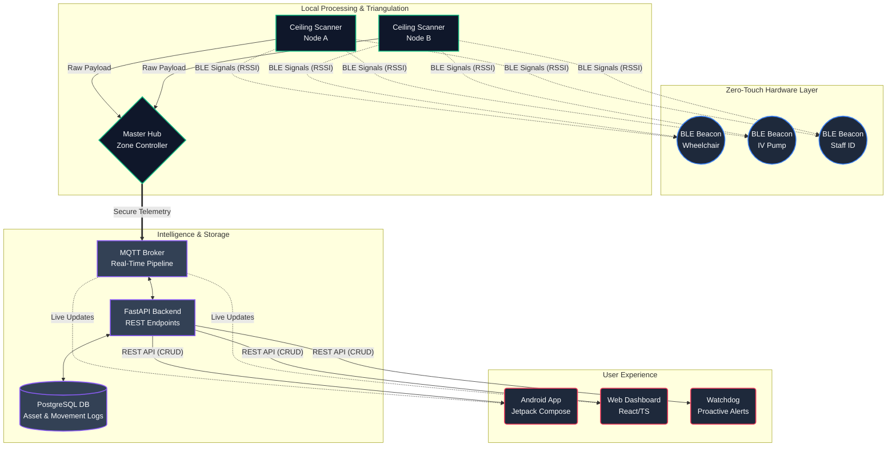

# BleX Enterprise Architecture

This document provides a high-level system architecture diagram for the BleX asset tracking platform, designed for your stakeholders. It visualizes the flow of data from physical assets up to the Fleet Manager application.

### **Key Takeaways for Stakeholders:**
1. **Zero-Touch Hardware**: Assets only broadcast passive signals. They require no manual scanning or power-hungry GPS tracking.
2. **Edge Intelligence**: The "Master Hubs" calculate movement locally before sending data, drastically reducing network bandwidth and cloud costs.
3. **Sub-Second Real-Time**: The `MQTT Broker` ensures that the moment an asset enters a new zone, the apps on the nurses' or managers' phones update instantly without needing to manually refresh the page.
